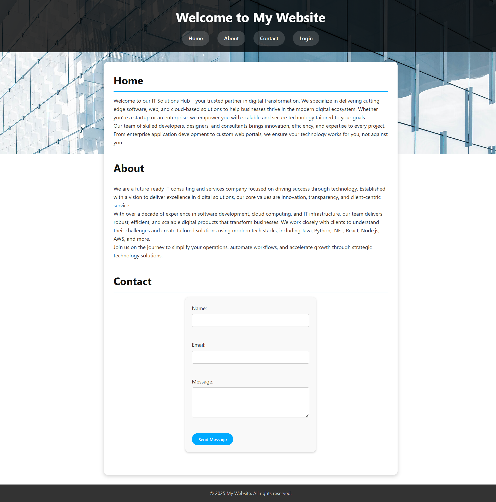
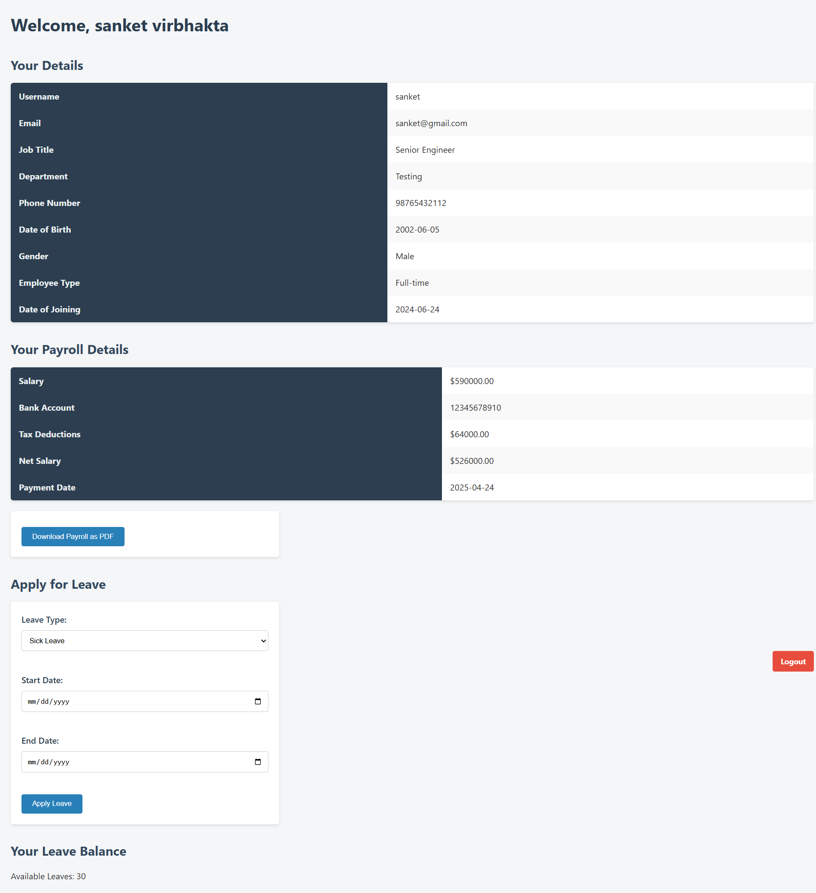
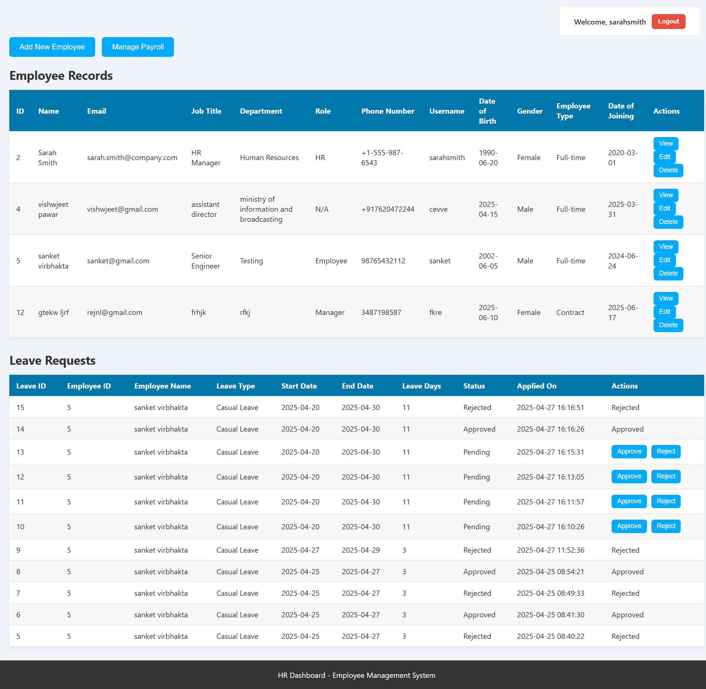
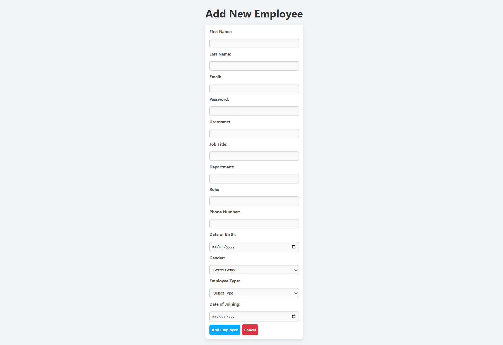
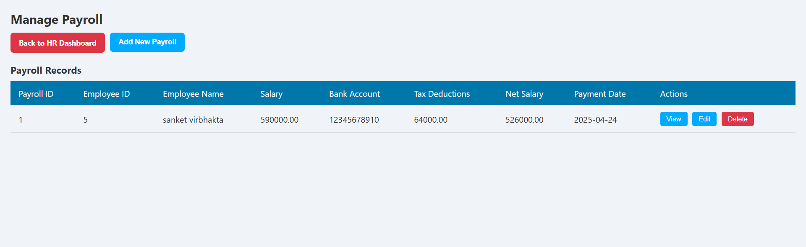

# 🏢 Employee Leave Management System

A full-stack web application that allows employees to **apply for leave**, enables HR to **manage employee records and payroll**, and provides a streamlined leave management workflow. Built using Java, JSP, Servlets, and MySQL with a responsive frontend in HTML, CSS, and JavaScript.

---

## 📘 Project Overview

**Technologies Used**: Java · JSP · Servlets · JDBC · EL · JSTL · MySQL · HTML · CSS · JavaScript · Maven

- 🧩 Developed a **role-based leave management system** for employees and HR.  
- 🔐 Implemented **secure login** using sessions and **BCrypt password hashing**.  
- 🛠️ Performed **full CRUD operations** for employees, leave requests, and payroll records using **JDBC with MySQL**.  
- 🏗️ Followed **MVC architecture** for clean separation of concerns.  
- 📄 Integrated the **iText PDF library** to dynamically generate employee payroll reports and leave summaries.  
- 🎨 Ensured **responsive UI design** and **cross-browser compatibility** using HTML, CSS, and JavaScript.  

---

## 🚀 Features

- 👨‍💼 **Employee Login & Dashboard**  
- 📝 **Apply for Leave**  
- 👩‍💻 **HR/Admin Login & Dashboard**  
- 📂 Add/Edit/Delete Employee Records (HR/Admin)  
- 💰 View and Generate Payroll Reports  
- 📄 Generate Leave Summaries in PDF  
- 🔐 Session-Based Access Control  
- 📱 Responsive Web Interface  

---

## 🖼️ Screenshots

| Feature | Screenshot |
|---------|------------|

| 🏠 Front Page
| 🔐 Login |  |
| 👨‍💼 Employee Dashboard |  |
| 👩‍💻 HR Dashboard |  |
| 📂 Employee Management |  |
| 💰 Payroll Report |  |


---

## 🛠️ Tech Stack

- **Frontend**: HTML, CSS, JavaScript  
- **Backend**: Java Servlets, JSP  
- **Database**: MySQL  
- **Database Access**: JDBC  
- **Server**: Apache Tomcat  
- **Libraries**: iText PDF for report generation, BCrypt for password hashing  
- **Build Tool**: Maven  
- **Architecture**: MVC  
- **IDE**: Eclipse  

---

## ⚙️ How to Run Locally

1. **Clone the Repository**
   ```bash
   git clone https://github.com/lukeshsable/Employee_Leave_Management_System_Project.git
   cd Employee_Leave_Management_System_Project
